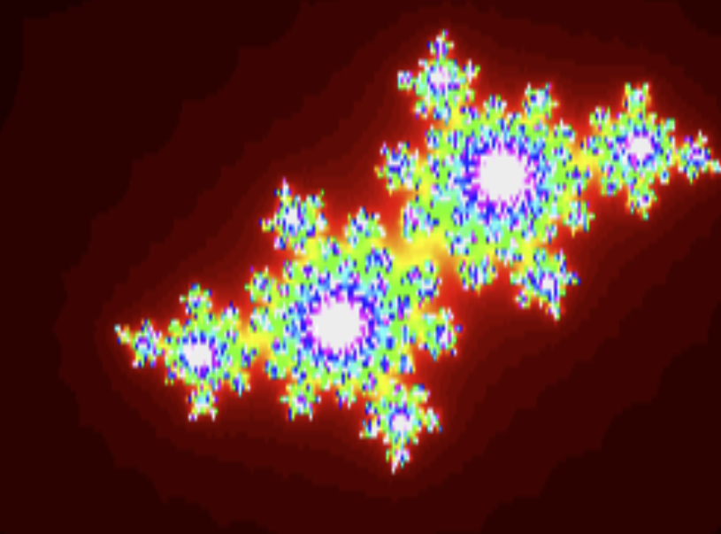

# Freactal: React Fractal

Someone mention fractals? Everyone should have pretty fractals on their website.

Here you go, have a fractal.



Demo: http://freactal.basementuniverse.com/

## Installation

```bash
npm install @basementuniverse/freactal
```
```bash
yarn add @basementuniverse/freactal
```

## How to use

```typescript
import { Fractal } from '@basementuniverse/freactal';
```

```jsx
<Fractal
  scale={4}
  offset={{ x: 0, y: 0 }}
/>
```

### Props

```typescript
type FractalProps = {
  /**
   * The class name to apply to the fractal container
   */
  className?: string;

  /**
   * The style to apply to the fractal container
   */
  style: CSSProperties;

  /**
   * The fractal canvas background colour
   */
  backgroundColour?: {
    x: number;
    y: number;
    z: number;
  };

  /**
   * An array of fractal canvas foreground colours
   */
  foregroundColours?: {
    x: number;
    y: number;
    z: number;
  }[];

  /**
   * The fractal scale
   */
  scale?: number;

  /**
   * The fractal offset
   */
  offset?: {
    x: number;
    y: number;
  };

  /**
   * If true, render a Julia set instead of a Mandelbrot set
   */
  julia?: boolean;

  /**
   * The Julia set preset to use
   */
  juliaPreset?:
    | 'a'
    | 'b'
    | 'c'
    | 'd'
    | 'e'
    | 'f'
    | 'g'
    | 'h'
    | 'i';

  /**
   * The real component of the fractal constant
   */
  a?: number;

  /**
   * The imaginary component of the fractal constant
   */
  b?: number;
}
```
